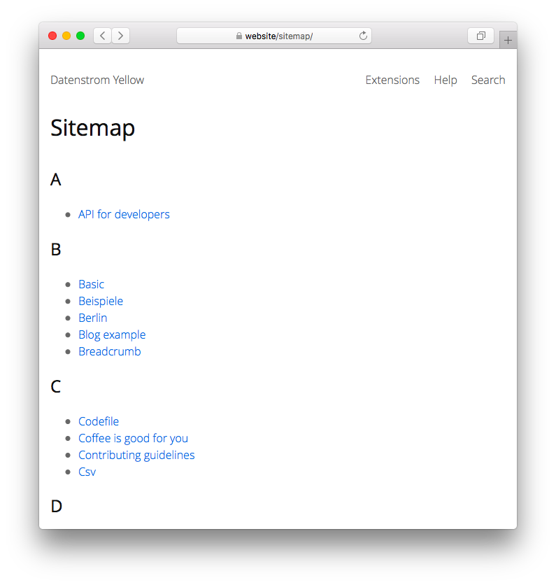

<a href="README-de.md">Deutsch</a> &nbsp; <a href="README.md">English</a> &nbsp; <a href="README-sv.md">Svenska</a>

# Sitemap 0.9.2

Sitemap with all pages.

## How to install an extension

[Download ZIP file](https://github.com/annaesvensson/yellow-sitemap/archive/refs/heads/main.zip) and copy it into your `system/extensions` folder. [Learn more about extensions](https://github.com/annaesvensson/yellow-update).

## How to use a sitemap

The sitemap is available as `http://website/sitemap/` and `http://website/sitemap/page:sitemap.xml`. It's an overview of the entire website, only visible pages are included.

If you don't want that a page is visible, set `Status: unlisted` in the [page settings](https://github.com/annaesvensson/yellow-core#settings-page) at the top of a page.

## Examples

Content file with link to sitemap:

    ---
    Title: Example page
    ---
    Lorem ipsum dolor sit amet, consectetur adipisicing elit, sed do eiusmod tempor incididunt ut 
    labore et dolore magna pizza. Ut enim ad minim veniam, quis nostrud exercitation ullamco laboris 
    nisi ut aliquip ex ea commodo consequat. Duis aute irure dolor in reprehenderit in voluptate velit 
    esse cillum dolore eu fugiat nulla pariatur. Excepteur sint occaecat cupidatat non proident, sunt 
    in culpa qui officia deserunt mollit anim id est laborum.
    
    [See all pages](/sitemap/).

Content file with unlisted page:

    ---
    Title: Unlisted page
    Status: unlisted
    ---
    This page is not visible in the sitemap.

## Settings

The following settings can be configured in file `system/extensions/yellow-system.ini`:

`SitemapLocation` = sitemap location  
`SitemapFileXml` = sitemap file name with XML information  
`SitemapPaginationLimit` = number of entries to show per page, 0 for unlimited  

The following files can be customised:

`system/layouts/sitemap.html` = layout file for sitemap  

## Developer

Anna Svensson. [Get help](https://datenstrom.se/yellow/help/).
